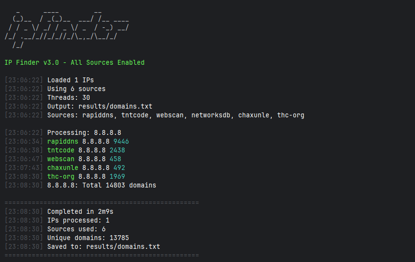

# reverse ip



Reverse IP is a reverse IP lookup tool that identifies domains hosted on the same IP address. It leverages multiple
passive online data sources to provide accurate and comprehensive results. Built with performance and modularity in
mind, this tool is designed for security researchers, penetration testers, and bug bounty hunters.

## Features

- **Multi-source lookup**: Queries 6 different data sources simultaneously
- **High performance**: Concurrent processing with configurable thread counts
- **Flexible input**: Supports single IP addresses or files containing IP lists
- **Smart filtering**: Removes duplicates and normalizes domain outputs
- **Graceful shutdown**: Proper handling of interrupt signals (Ctrl+C)
- **Cross-platform**: Works on Windows, Linux, and macOS
- **Multiple output formats**: Save results to specified files
- **Verbose logging**: Detailed progress reporting when needed

## Installation

### Prerequisites

- Go 1.21 or higher
- Git (for cloning the repository)

### Method 1: Install from Source

```bash
# Clone the repository
git clone https://github.com/VampXDH/ipfinder.git
cd ipfinder

# Build the binary
go build -o ipfinder cmd/ipfinder/main.go

# Move to PATH (optional)
sudo mv ipfinder /usr/local/bin/  # Linux/macOS
# Or copy to Windows System32 for Windows
```

### Method 2: Install via Go

```bash
# Install directly using go install
go install github.com/VampXDH/ipfinder/cmd/ipfinder@latest

# Ensure GOPATH/bin is in your PATH
export PATH=$PATH:$(go env GOPATH)/bin  # Linux/macOS
# For Windows, add %USERPROFILE%\go\bin to your PATH
```

### Method 3: Download Pre-built Binary

Check the Releases section for pre-built binaries for your platform.

## Usage

### Basic Command Structure

```bash
ipfinder [options]
```

### Options

| Option        | Description                    | Default               |
|---------------|--------------------------------|-----------------------|
| `-d`          | Single IP address to scan      | -                     |
| `-l`          | File containing list of IPs    | -                     |
| `-o`          | Output file                    | `results/domains.txt` |
| `-t`          | Number of concurrent threads   | 30                    |
| `-v`          | Verbose output                 | false                 |
| `-silent`     | Silent mode (only shows count) | false                 |
| `-no-color`   | Disable color output           | false                 |
| `-h`, `-help` | Show help message              | -                     |

### Examples

Scan a single IP address:

```bash
ipfinder -d 8.8.8.8
```

Scan multiple IPs from a file with 100 threads:

```bash
ipfinder -l ips.txt -t 100 -o results.txt
```

Enable verbose mode for detailed output:

```bash
ipfinder -d 1.1.1.1 -v
```

Run in silent mode (only outputs domain count):

```bash
ipfinder -l ips.txt -silent
```

Disable colored output:

```bash
ipfinder -d 8.8.8.8 -no-color
```

## Input Format

The tool accepts IP addresses in standard IPv4 format. For file input, create a text file with one IP address per line:

```txt
8.8.8.8
1.1.1.1
142.250.185.206
104.16.132.229
```

Comments are supported using `#` or `//` prefixes:

```txt
# Cloudflare DNS
1.1.1.1

// Google DNS
8.8.8.8

# YouTube
142.250.185.206
```

## Output

By default, results are saved to `results/domains.txt` in the current directory. The output file contains one domain per
line:

```txt
google.com
youtube.com
facebook.com
cloudflare.com
```

The tool automatically:

- Removes duplicate domains
- Normalizes domain names (removes www, protocols, paths)
- Sorts domains alphabetically (in some sources)
- Creates the output directory if it doesn't exist

## Data Sources

IP Finder queries the following sources:

1. **RapidDNS** - Rapid domain name system queries
2. **TNTcode** - TNTcode reverse IP lookup
3. **WebScan** - WebScan.cc API
4. **NetworksDB** - Networks Database lookup
5. **Chaxunle** - Chinese reverse IP service
6. **THC.org** - The Hacker's Choice service

Each source is queried with appropriate delays and rate limiting to respect service terms.

## Advanced Usage

### Performance Tuning

For large IP lists, increase thread count:

```bash
ipfinder -l large-list.txt -t 200 -o output.txt
```

For detailed debugging information:

```bash
ipfinder -d 8.8.8.8 -v -o debug.txt
```

### Integration with Other Tools

Pipe output to other tools:

```bash
# Count unique domains
ipfinder -l ips.txt -silent | wc -l

# Filter specific domains
ipfinder -d 8.8.8.8 | grep "google"

# Combine with other reconnaissance tools
ipfinder -l ips.txt -o domains.txt && cat domains.txt | httpx -silent
```

### Batch Processing

Create a batch script for multiple scans:

```bash
#!/bin/bash
for ip in $(cat ips.txt); do
    ipfinder -d $ip -o results/$ip.txt
    sleep 2
done
```

## Building from Source

### Linux/macOS

```bash
git clone <respoitory_url>
cd ipfinder
go build -o ipfinder cmd/ipfinder/main.go
./ipfinder -d 8.8.8.8
```

### Windows

```bash
git clone <respoitory_url>
cd ipfinder
go build -o ipfinder.exe cmd/ipfinder/main.go
.\ipfinder.exe -d 8.8.8.8
```

## Error Handling

The tool includes comprehensive error handling:

- **Invalid IP addresses**: Warns and skips invalid entries
- **Network errors**: Retries with exponential backoff
- **File errors**: Provides clear error messages
- **Rate limiting**: Implements delays between requests
- **Timeout handling**: Configurable timeouts for all requests

## Troubleshooting

### Common Issues

**"command not found: ipfinder"**
Ensure the binary is in your PATH or use `./ipfinder` (Linux/macOS) or `.\ipfinder.exe` (Windows).

**"No valid IPs found in file"**
Check your input file format and ensure it contains valid IP addresses.

**"Connection refused" or "Timeout"**
Check your internet connection and firewall settings. Some sources may be blocked in certain regions.

**"Too many open files" (Linux/macOS)**
Increase your system's file descriptor limit:

```bash
ulimit -n 4096
```

### Debug Mode

For detailed error information, run with verbose flag:

```bash
ipfinder -d 8.8.8.8 -v
```

## Performance Considerations

- Default thread count (30) works well for most use cases
- Increase thread count (`-t`) for faster scanning of large lists
- Decrease thread count for unreliable network connections
- Each source query includes a 1-3 second delay to avoid rate limiting
- HTTP client timeout is set to 120 seconds

## Limitations

- Results depend on the accuracy and completeness of third-party sources
- Some sources may have rate limits or usage restrictions
- IPv6 support is limited in some data sources
- The tool is designed for legitimate security research only

## Contributing

To add a new data source:

1. Implement the `Source` interface in `internal/source/source.go`
2. Add the source to the scanner's source list in `internal/scanner/scanner.go`
3. Test thoroughly with various IP addresses
4. Submit a pull request with your changes

## License

This project is licensed under the MIT License. See the [LICENSE](LICENSE) file for details.

## Disclaimer

This tool is intended for authorized security testing and research only. Users are responsible for complying with all
applicable laws and terms of service of the queried data sources. The authors are not responsible for any misuse or
damage caused by this tool.

## Support

For issues, feature requests, or questions:

1. Check the existing issues on GitHub
2. Create a new issue with detailed information
3. Provide sample commands and error messages when reporting bugs
   ial release with basic reverse IP lookup functionality
